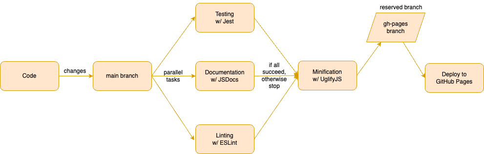

# CI / CD PIPELINE

# Using GitHub Actions
## Triggered by changes to `main` branch
----
## Currently Functional:

#### Testing
- Using Jest for a unit testing
- Tests defined in `__tests__` folder as `*.test.js`

#### Linting
- Using ESLINT
- Using slightly modified AirBnB style guidelines (specified in `package.json`)

#### Documentation
- Using JSDocs
- Documentation pushed to `jsdocs/` folder in the form of `.html` files

#### Minification
- Continues only if all three of the previous steps succeeded, i.e.
    * All unit tests passed
    * All style guidelines passed
    * JSDocs successfully created
- Javascript is minifed using UglifyJS
- Extra files are skinned from the repo and everything is placed into a new branch `gh-pages`

#### Final Deployment
- `gh-pages` is deployed to GitHub Pages
- Site is live at [zoltar.live](https://zoltar.live) and JSDocs are available at [zoltar.live/jsdocs](https://zoltar.live/jsdocs)

#### Diagram
- 
- Hyperlink: [phase1diagram.png](phase1.png)
----
## Future Plans:

### Code Quality
- We looked at CodeClimate and are planning to implement code quality review through it

### Image/Audio Compression
- We can continue to make our `gh-pages` version lighter and lighter through more optimizations such as image and audio file compression before deployment

