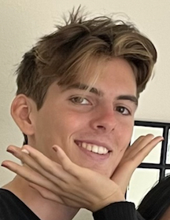
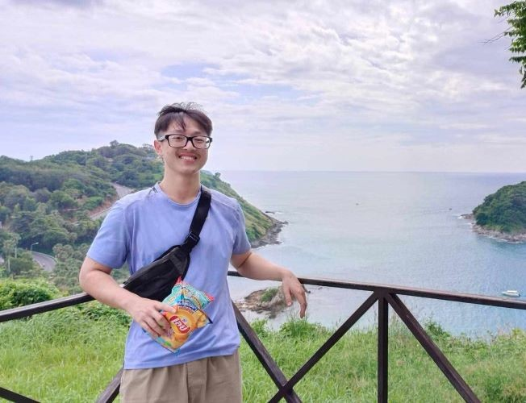
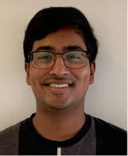
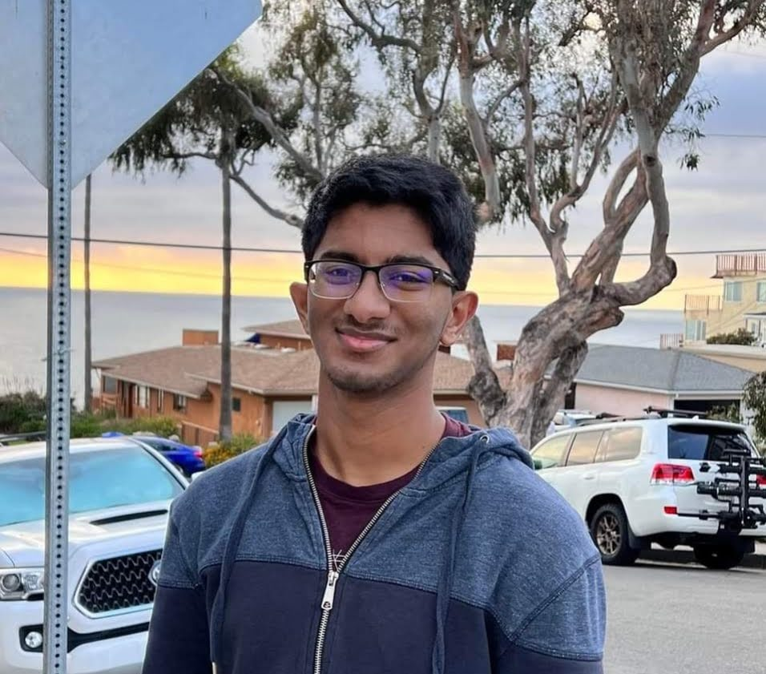
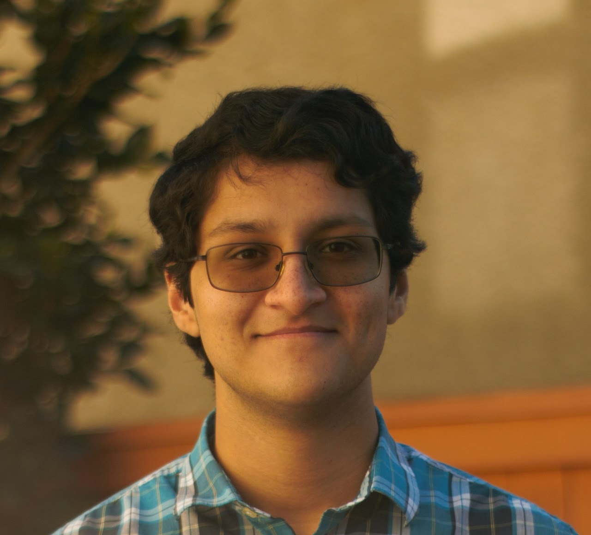
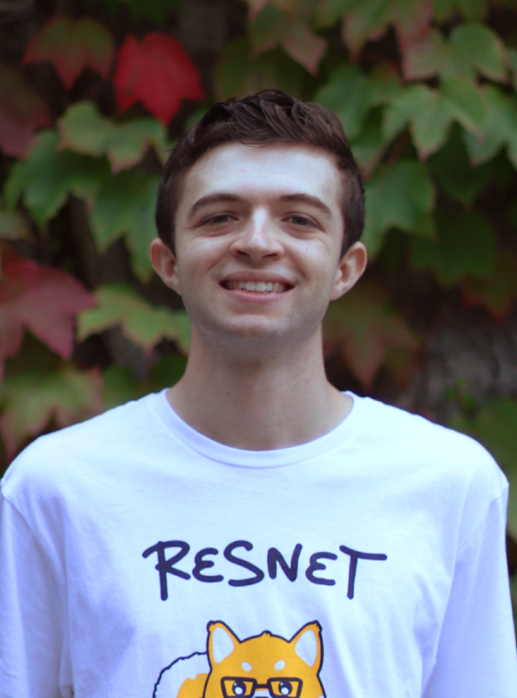

# TEAM FORTUNE 500 &emsp; &emsp; &emsp;  &emsp; &emsp; &emsp; &emsp; &emsp; &emsp; &emsp; &emsp; &emsp; &emsp; &emsp; &emsp; &ensp; 

 

## About Us:

Originally just Team 23, we are now **FORTUNE 500**, a group of ten UC San Diego students in CSE 110 SP23. We are using AGILE methodologies to develop fortune-telling-related web applications. We value collaboration, clear expectations, and a good joke. We believe that some facets of a successful team include ensuring an environment where team members are comfortable to reach out for help, supporting each other's ideas, and treating everyone and their work equally important. We pledge to uphold all the rules established in our [team contract](./misc/rules.md) in our pursuit of more effective software development and engineering practices.
 

## The Team:

### **Luke Sheltraw**, Leader [(GitHub)](https://github.com/Luke-Sheltraw)

Born in Albany, California, Luke is a 2nd year Math/CS major in Sixth College. When he's not in class, he enjoys riding his bike and listening to music. 
 

### **Luke Skerrett**, Leader [(GitHub)](https://github.com/LukeSkerrett)

Luke is a 3rd year Math/CS major at Seventh College from Simi Valley, California. In his free time he loves to play basketball, listen to music, and freestyle rap.
 

### **Marc Baeuerle**, Designer [(GitHub)](https://github.com/MarcBaeuerle)

 

### **Eric Vu**, Planner [(GitHub)](https://github.com/air-wickvu)

Eric is a 3rd year Computer Engineering Major at Warren College. On his days off he likes to relax on the beach, enjoy live concerts, spending quality time with family and friends. 
 

### **Neel Basu**, Developer [(GitHub)](https://github.com/neel-basu)

Neel Basu is a second year Computer Science Major at Marshall College. He enjoys hanging out with his friends, watching movies, and playing volleyball in his free time.
 

### **Xiaonan Fu**, Developer [(GitHub)](https://github.com/XiaonanFu-ucsd)
Xiaonan is a third year Cognitive Science major at Warren College. He plays the Game Battlefield V a lot and enjoys watching anime. 

### **Prashasth Katukojwala**, Developer [(GitHub)](https://github.com/prashasthk)

Prashasth is a second year Computer Science student in Warren. In his free time, he enjoys watching films, listening to music, or just chatting with his friends.
 

### **Aatash Pestonjamasp**, Developer [(GitHub)](https://github.com/AAP127)

Aatash is a second year Computer Engineering student in Warren college. Outside of classes, he enjoys riding his bike and hanging out with friends.
 

### **Runpeng Jian**, Developer [(GitHub)](https://github.com/RunpengJ)
Runpeng is a third year Computer Science Major at Warren College. He likes to do sports, listen to music and watch anime in his spare time.
 

### **Christopher Hashim**, Developer [(GitHub)](https://github.com/chashim39)

Christopher is a third year Computer Engineering student at Sixth college. He enjoys building computers, video games, and hiking.
 
